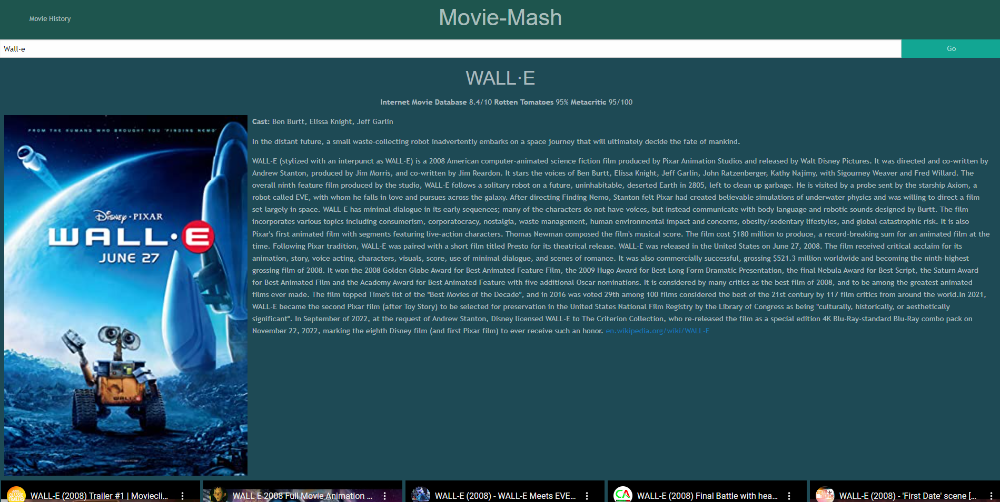

# Movie-Mash

## Description

The goal of Movie-Mash is to provide a user with as much information about any movie they search for as possible. This project helps the user determine whether a movie is worth watching or not, by providing them with a list of information about the movie.

## Credits

John Scicluna - [GitHub](https://github.com/scicluna)

Corbin Johns - [GitHub](https://github.com/cxrstings)

Joycell Johnson - [GitHub](https://github.com/Joy-Johns)

Ben Smyth - [GitHub](https://github.com/bsmyth310)

 
 

## License

MIT License

Copyright (c) 2023 Luke

Permission is hereby granted, free of charge, to any person obtaining a copy
of this software and associated documentation files (the "Software"), to deal
in the Software without restriction, including without limitation the rights
to use, copy, modify, merge, publish, distribute, sublicense, and/or sell
copies of the Software, and to permit persons to whom the Software is
furnished to do so, subject to the following conditions:

The above copyright notice and this permission notice shall be included in all
copies or substantial portions of the Software.

THE SOFTWARE IS PROVIDED "AS IS", WITHOUT WARRANTY OF ANY KIND, EXPRESS OR
IMPLIED, INCLUDING BUT NOT LIMITED TO THE WARRANTIES OF MERCHANTABILITY,
FITNESS FOR A PARTICULAR PURPOSE AND NONINFRINGEMENT. IN NO EVENT SHALL THE
AUTHORS OR COPYRIGHT HOLDERS BE LIABLE FOR ANY CLAIM, DAMAGES OR OTHER
LIABILITY, WHETHER IN AN ACTION OF CONTRACT, TORT OR OTHERWISE, ARISING FROM,
OUT OF OR IN CONNECTION WITH THE SOFTWARE OR THE USE OR OTHER DEALINGS IN THE
SOFTWARE.